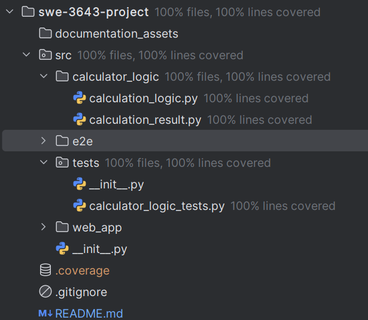

# KSU SWE 3643 Software Testing and Quality Assurance Semester Project: Web-Based Calculator
This repository contains the code for a calculator web application for a Quality Assurance and Software Testing class.
The src folder contains the modules for the calculator logic, unit tests, web aplication, and end-to-end tests. 
Documentation for the project is found here.

## Table of Contents

- [Environment](#environment)
- [Executing the Web Application](#executing-the-web-application)
- [Executing Unit Tests](#executing-unit-tests)
- [Reviewing Unit Test Coverage](#reviewing-unit-test-coverage)
- [Executing End-To-End Tests](#executing-end-to-end-tests)
- [Final Video Presentation](#final-video-presentation)

## Team Members

 Joss Hufnagel

## Architecture

TBD

## Environment

This is a cross-platform application and should work in Windows 10+, Mac OSx Ventura+, and Linux environments. 
Note that the application has only been carefully tested in Windows 11.

To prepare your environment to execute this application:
1. Install Python 3.12 or higher.
2. Ensure that pip is correctly installed, updated, and configured.
3. Ensure that git is correctly installed, updated, and configured
4. Use git to clone this repository to an accessible directory 
   1. Navigate to the accessible directory
   2. Use the following command to clone the repository:
    ```cmd
    git clone https://github.com/blade290/swe-3643-project
    ```
5. Download dependencies by using the following command:
    ```cmd
   pip install <path-to-requirements.txt> -r 
   ```
## Executing the Web Application

TBD

## Executing Unit Tests

To run the suite of unit tests, do the following:
1. Navigate to the project directory
2. Use the following command to run the unit tests with pytest:
    ```cmd
   python -m pytest src/tests/calculator_logic_tests.py
   ```
### Sample Output
```cmd
> python -m pytest src/tests/calculator_logic_tests.py
======================================= test session starts ========================================
platform win32 -- Python 3.12.7, pytest-8.3.4, pluggy-1.5.0
rootdir: C:\Users\jossh\OneDrive\Documents\GitHub\swe-3643-project
plugins: base-url-2.1.0, cov-6.0.0, playwright-0.6.2
collected 31 items                                                                                                                                                                                       

src\tests\calculator_logic_tests.py ...............................                           [100%] 

======================================== 31 passed in 0.06s ======================================== 
```

## Reviewing Unit Test Coverage

Calculator logic has received 100% test coverage:


## Executing End-To-End Tests

TBD

## Final Video Presentation

TBD
